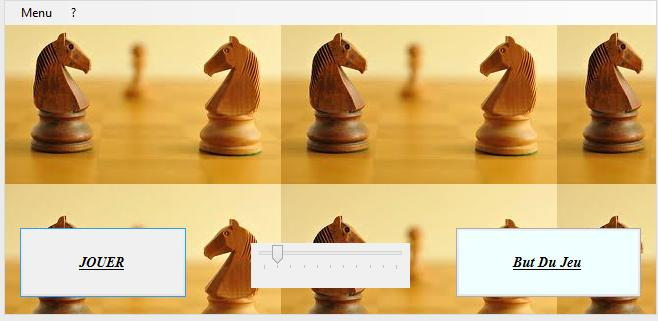
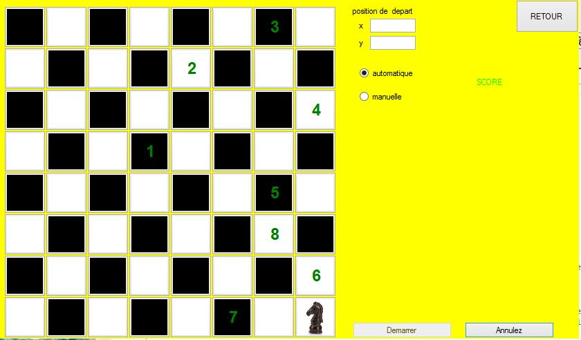

# Problème du cavalier

Le but de ce programme est de résoudre le problème du cavalier d'Euler. Un cavalier posé sur une case quelconque d'un d'échiquier doit en visiter toutes les cases sans passer deux fois sur la même. 


Le programme est écrit en ```C#```. Vous pouvez le télécharger et tester :+1: en suivant les instructions suivantes :  

1. [cloner le projet](https://github.com/AhmedSoftware/jeux-d-echec.git) ou [télécharger](https://github.com/AhmedSoftware/jeux-d-echec/archive/master.zip).
2. double click sur ```\bin\Debug\ProjetCavalierEssai.exe``` :ok_hand: pour démarrer le programme. 
3. la page de démarrage suivant s'affichera : 



4. En cliquant sur le bouton jouer, le programme va vous diriger sur cette page, 



5. Vous pouvez choisir pour l'un de deux modes :

  - Automatique : vous insérons les positions de départ du cavalier et ```l'algorithme d'heuristique``` s'exécute automatiquement.   
  - Manuelle: on déplace le cavalier et le programme nous affecte un score, et à la fin du partie, le score s'affiche. 
  
  Si vous avez des questions ou des remarques à faire, n'hésitez pas à me contacter. 
  
